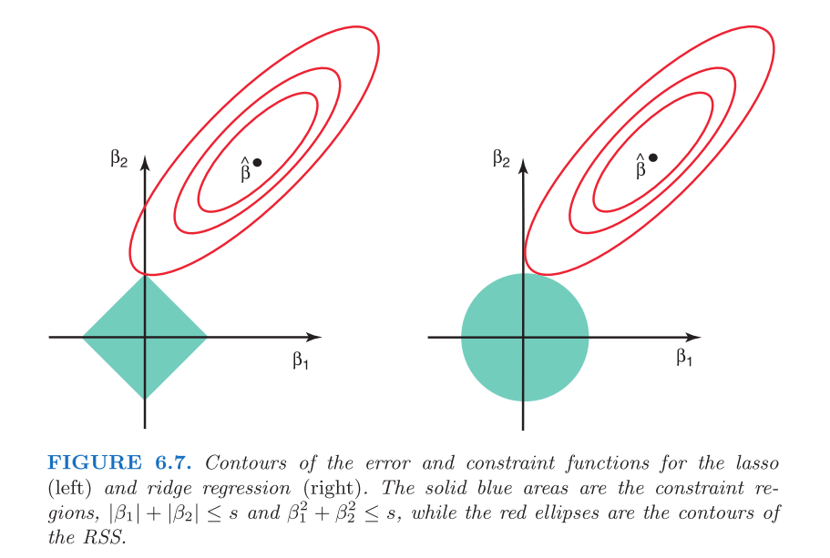

```{r setup, include=FALSE}
knitr::opts_chunk$set(echo = TRUE)
knitr::opts_chunk$set(results="hide")
knitr::opts_chunk$set(message=FALSE)

library(tidyverse)
library(ggplot2)
library(leaps)
library(caret)
library(glmnet)
library(splines)

library(ISLR2)

options(warn=-1) 
set.seed(7)
```
<style type="text/css">
@import url("https://cdn.jsdelivr.net/npm/bulma@0.9.3/css/bulma.min.css");
</style>


```{=html}
<hr />

<div class="card">
  <header class="card-header">
    <p class="card-header-title">
      1. Concept Review
    </p>
  </header>
</div>

<section class="section">
<div class="card">
  <header class="card-header">
    <p class="card-header-title">
      1.1 Lasso vs. Ridge Coefficients
    </p>
  </header>
  <div class="card-content">
    <div class="content">
     
     Lasso can set coefficients to zero in regression because of its penalty term. Ridge uses a parabola (beta^2) as it's penalty term, and Lasso uses an absolute value function. The penalty acts as a constraint for coefficient values. These constraints are shaped differently. As we increase the allowable error (RSS) in our model, the possible values of coefficients expand from what they would be without a penalty term. As we can see in the figure, ridge coefficients (right figure) will reach inside its circle shaped constraintbefore any coefficient can be zero. However, because Lasso uses an absolute value, it's constraint is shaped like a diamond, making it possible (and far easier) for the minimized Lasso value to occur at a coefficient of zero.<br>
      <figure class="image">
        
      </figure>
    </div>
  </div>
</div>

<br>

<div class="card">
  <header class="card-header">
    <p class="card-header-title">
      1.2 Effect of Lambda (Introducing Bias)
    </p>
  </header>
  <div class="card-content">
    <div class="content">
     <b>a.</b>
     iv: Introducing bias decreases variance, causing our fitted model to be less able to fit the data, increasing our training error.
     
     <br> <br>
     <b>b.</b>
     ii. There is an ideal tradeoff between variance and bias that gives the best test MSE. Deviating from that point will increase test MSE.
     
     <br> <br>
     <b>c.</b>
     iv: Variance steadily decreases and bias increases.
     
     <br> <br>
     <b>d.</b>
     iii: We are introducing bias as Lambda increases, so bias squared should increase.
     
     <br> <br>
     <b>e.</b>
     v: Irreducible error never changes.
     
    </div>
  </div>
</div>
</section>

<hr />
```

```{=html}
<div class="card">
  <header class="card-header">
    <p class="card-header-title">
      2. Building a predictive model
    </p>
  </header>
</div>
```
```{r}
n = nrow(Boston)
vars = names(Boston)
vars.length = length(vars)

# Generating interaction and 2nd degree polynomial terms
for (i in 2:(vars.length - 1)) {
  for (j in (i+1):vars.length) {
    Boston <- cbind(Boston, Boston[,i] * Boston[,j])
    names(Boston)[ncol(Boston)] <- paste0(vars[i], "*", vars[j])
  }
}
for (i in 2:vars.length) {
  Boston <- cbind(Boston, Boston[,i]^2)
  names(Boston)[ncol(Boston)] <- paste0(vars[i], "^2")
}

# Get train and test set
test_index = sample(1:n, n/10, replace=FALSE)
test = Boston[test_index,]
train = Boston[-test_index,]

# Scatter matrix
# pairs(Boston)
```
```{r results="show"}
# Utility function for printing out regression equations
printEquation = function(reg_fit, which_var, dependent_var) {
  cc = coef(reg_fit, which_var)
  eqn = paste(dependent_var, "=", paste(round(cc[1],4), paste(round(cc[-1],4), names(cc[-1]), sep=" * ", collapse=" + "), sep=" + "))
  (eqn = gsub('\\+ -', '- ', gsub(' \\* ', '*', eqn)))
}

# forward stepwise selection on all transformed training data
regfit.fwd = regsubsets(log(crim)~., data=train, nvmax=ncol(train) - 1, method="forward")
regfit.fwd.sum = summary(regfit.fwd)

p = rowSums(regfit.fwd.sum$which)
rss = regfit.fwd.sum$rss

fwd.BIC = n*log(rss/n) + p*log(n)

#printEquation(regfit.fwd, which.min(fwd.BIC), "log(crim)")

fwd.selected = train[, regfit.fwd.sum$which[which.min(fwd.BIC),]]
regfit.fwd.best = lm(log(crim)~., data=fwd.selected)
regfit.fwd.best.sum = summary(regfit.fwd.best)
regfit.fwd.best.sum
plot(regfit.fwd.best, which=1, sub="Forwards Stepwise Selected Model")


# backwards
regfit.bwd = regsubsets(log(crim)~., data=train, nvmax=ncol(train) - 1, method="backward")
regfit.bwd.sum = summary(regfit.bwd)

p = rowSums(regfit.bwd.sum$which)
rss = regfit.bwd.sum$rss

bwd.BIC = n*log(rss/n) + p*log(n)

#printEquation(regfit.bwd, which.min(bwd.BIC), "log(crim)")

bwd.selected = train[, regfit.bwd.sum$which[which.min(bwd.BIC),]]
regfit.bwd.best = lm(log(crim)~., data=bwd.selected)
regfit.bwd.best.sum = summary(regfit.bwd.best)
regfit.bwd.best.sum
plot(regfit.bwd.best, which=1, sub="Backwards Stepwise Selected Model")
```
```{=html}
<section class="section">
<div class="card">
  <header class="card-header">
    <p class="card-header-title">
      2.1 Least-Squares Model
    </p>
  </header>
  <div class="card-content">
    <div class="content">
     See output above for the lm equations. <br>
     The model was fitted with forward step-wise selection to predict log(crim) to deal with heteroskedasticity, including 2nd degree polynomial and pairwise interaction terms. The selected model ended with several polynomial and interaction terms. The linear model likely needs polynomial and interaction terms. I chose to include polynomial terms in the model selection space because the pairwise scatter plots showed many clear non-linear relationships.
     <br>
     We can see higher variability in the data around two fitted values of log(crim) in the residual plot. It's possible that a regression spline with 1-4 knots could improve the model, either splitting directly between those two variable areas or segmenting off the variable areas.
    </div>
  </div>
</div>
</section>
```
```{r}
k=10
folds <- createFolds(bwd.selected$crim, k = k, list = TRUE, returnTrain = FALSE)

Fold_MSEs = data.frame()
for (i in 1:k) {
  spline.test_index = folds[[i]]
  spline.test = bwd.selected[spline.test_index,]
  spline.train = bwd.selected[-spline.test_index,]
  
  MSEs = c()
  for (df in 1:10) {
    spline = lm(crim~.-`indus^2`-`nox^2`-`age^2`-`tax^2`-`ptratio^2` + ns(indus, df = df) + ns(nox, df = df) + ns(age, df = df) + ns(tax, df = df) + ns(ptratio, df = df), data=spline.train)
    spline.predicted = predict(spline, spline.test)
    
    MSEs = append(MSEs, mean((spline.test$crim - spline.predicted)^2))
  }
  
  Fold_MSEs = rbind(Fold_MSEs, MSEs)
}
```
```{r}
for(i in 1:10) {
  print(paste("CV test MSE for model", i, "is", mean(Fold_MSEs[,i])))
}
```
```{=html}
<section class="section">
<div class="card">
  <header class="card-header">
    <p class="card-header-title">
      2.1 Least-Squares Model
    </p>
  </header>
  <div class="card-content">
    <div class="content">
     To test if splines will improve the model, we can perform cross validation on a cubic spline for every polynomial term selected by backwards stepwise-selection. I chose the backwards stepwise because I felt like it. After finding the best model with a spline, we will test it vs the other models using the test set.<br>
     Best df is 1. This suggests that a spline does not improve the best backwards stepwise model. I won't bother testing it.
  </div>
</div>
</section>
```


```{r}
grid = 10^seq(10,-2,length=100)
X = model.matrix(log(crim)~., data=train)[,-1]
Y = log(train$crim)
```
```{r results="show"}
ridge.cv = cv.glmnet(X, Y, alpha=0, lambda = grid)
ridge.lambda.best = ridge.cv$lambda.min
ridge.lambda.1se = ridge.cv$lambda.1se
Model2a = glmnet(X, Y, alpha = 0, lambda = ridge.lambda.best)
Model2b = glmnet(X, Y, alpha = 0, lambda = ridge.lambda.1se)

lasso.cv = cv.glmnet(X, Y, alpha = 1, lambda = grid)
lasso.lambda.best = lasso.cv$lambda.min
lasso.lambda.1se = lasso.cv$lambda.1se
Model3a = glmnet(X, Y, alpha = 1, lambda = lasso.lambda.best)
Model3b = glmnet(X, Y, alpha = 1, lambda = lasso.lambda.1se)

coef(Model2a)
coef(Model2b)
coef(Model3a)
coef(Model3b)
```
```{=html}
<section class="section">
<div class="card">
  <header class="card-header">
    <p class="card-header-title">
      2.2+3 Ridge and Lasso
    </p>
  </header>
  <div class="card-content">
    <div class="content">
     See output above for the models. Forgive me, for I don't know a better way to display these
     </div>
  </div>
</div>
</section>
```

```{r results="show"}
X.test = model.matrix(log(crim)~., data=test)
Y.test = log(test$crim)

fwd.test.MSE = mean((predict(regfit.fwd.best, newdata=test) - Y.test)^2)
bwd.test.MSE = mean((predict(regfit.bwd.best, newdata=test) - Y.test)^2)
ridge.test.MSE = mean((predict(Model2a, s = ridge.lambda.best, newx=X.test[,-1]) - Y.test)^2)
lasso.test.MSE = mean((predict(Model3a, s = lasso.lambda.best, newx=X.test[,-1]) - Y.test)^2)

fwd.test.MSE
bwd.test.MSE
ridge.test.MSE
lasso.test.MSE
```
```{=html}
<section class="section">
<div class="card">
  <header class="card-header">
    <p class="card-header-title">
      2.4 Final Model
    </p>
  </header>
  <div class="card-content">
    <div class="content">
     I choose my best forward stepwise selected model because it has the lowest test MSE of 0.4088. It does not contain all features because some are probably not useful in making predictions. If it was the ridge regression, then it would contain all variables because it can't physically set coefficients to 0.
     </div>
  </div>
</div>
</section

<hr />
```

```{=html}
<div class="card">
  <header class="card-header">
    <p class="card-header-title">
      3. Bootstrap
    </p>
  </header>
</div>
```
```{r}
# Fixing dataset
Boston = Boston[,1:13]
```
```{r results="show"}
(mu_hat = mean(Boston$medv))
(se_hat = sd(Boston$medv)/sqrt(length(Boston$medv)))
```
```{=html}
<div class="card">
  <header class="card-header">
    <p class="card-header-title">
      3a+b Mean and Standard Error
    </p>
  </header>
  <div class="card-content">
    <div class="content">
     Estimate mean and standard error as 22.53 and 0.409, respectively. The typical difference between the sample mean and population mean is 0.409. The variability seems low.
     </div>
  </div>
</div>
```

```{r results="show"}
B = 1000
b.means = rep(0,B)
n = dim(Boston)[1]
for(i in 1:B){
	index = sample(1:n,n,replace=TRUE)
	bootsample = Boston[index,]
	b.means[i] = mean(bootsample$medv)
}

(b.mean = mean(b.means))

(b.se = sqrt(sum((b.means-b.mean)^2)/(B-1)))


```
```{=html}
<div class="card">
  <header class="card-header">
    <p class="card-header-title">
      3c Bootstrap mean
    </p>
  </header>
  <div class="card-content">
    <div class="content">
        The mean and standard error acquried from bootstrap are extremely similar to their siblings obtained from analytical formulas.
     </div>
  </div>
</div>
```

```{r}
n = nrow(Boston)
B = 500
m = 100
Fstar = rep(0,B)
b.means = rep(0,m)
```
```{r}
b.mean.star = mean(Boston$medv)
b.se.star = sd(Boston$medv)/sqrt(length(Boston$medv))
```
```{r results="show"}
for(b in 1:B){
  index = sample(1:n,n,replace=TRUE)
  b.mean.hat = mean(Boston$medv[index])
  for(i in 1:m){
    index2 = sample(index,n,replace=TRUE)
    bootsample2 = Boston$medv[index2]
    b.means[i] = mean(bootsample2)
  }
  b.se.means = sqrt(sum((b.means-mean(b.means))^2)/(m-1))

  Fstar[b] = (b.mean.hat - b.mean.star)/b.se.means
}
print("Bootstrap CI:")
quantile(Fstar,c(0.025, 0.975))
b.mean.star + quantile(Fstar, 0.025)*b.se.star
b.mean.star + quantile(Fstar, 0.975)*b.se.star

print("Analytical CI:")
b.mean.star + qt(0.975, df=n-1)*b.se.star
b.mean.star + qt(0.025, df=n-1)*b.se.star
```
```{=html}
<div class="card">
  <header class="card-header">
    <p class="card-header-title">
      3d Bootstrap mean CI
    </p>
  </header>
  <div class="card-content">
    <div class="content">
        The CIs are very similar, but the bootstrapped interval is not symmetrical around the mean. This is because bootstrap does not assume the distribution is normal (and symmetrical).
     </div>
  </div>
</div>
```

```{r results="show"}
B = 1000
bootstrap.median = rep(0,B)
n = dim(Boston)[1]
for(i in 1:B){
	index = sample(1:n,n,replace=TRUE)
	bootsample = Boston[index,]
	bootstrap.median[i] = median(bootsample$medv)
}
b.median = mean(bootstrap.median)
paste("Bootstrapped Median:",b.median)
paste("Bootstrapped SE of Median:", sqrt(sum((bootstrap.median-b.median)^2)/(B-1)))


bootstrap_10 = rep(0,B)
n = dim(Boston)[1]
for(i in 1:B){
	index = sample(1:n,n,replace=TRUE)
	bootsample = Boston[index,]
	bootstrap_10[i] = quantile(bootsample$medv,0.10)
}

b.10p = mean(bootstrap_10)
paste("Bootstrapped SE of 10th percentile of medv", b.10p)
paste("Bootstrapped SE of 10th percentile of medv", sqrt(sum((bootstrap_10-b.10p)^2)/(B-1)))

```
```{=html}
<div class="card">
  <header class="card-header">
    <p class="card-header-title">
      3e-h Bootstrap median
    </p>
  </header>
  <div class="card-content">
    <div class="content">
        The standard error of the tenth percentile is slightly higher compared to that of the median. The bootstrapped median is slightly smaller than the mean as expected because medv is right skewed.
     </div>
  </div>
</div>

<hr />
```

```{=html}
<div class="card">
  <header class="card-header">
    <p class="card-header-title">
      4. Properties of Bootstrap
    </p>
  </header>
  <div class="card-content">
    <div class="content">
        a. n = number of observations in the original and bootstrap sample. If we simply pick one observation, the odds of it being a single jth observation is trivially 1/n.
        <br><br>
        b. Complement of (a). 1 - 1/n
        <br><br>
        c. e repeat (b) b times, giving (1 - 1/n)^n
        <br><br>
        d. Here n = 5, using the complement of (c), that the jth observation IS IN the bootstrap sample.. 1 - (1 - 1/n)^5
        <br><br>
        e. n = 100. 1 - (1 - 1/n)^100
        <br><br>
        f. n = 10000. 1 - (1 - 1/n)^10000 = 0.6321
     </div>
  </div>
</div>
```


```{r}

x = 1:10000
y = 1 - (1 - 1/x)^x

data = data.frame(
  n=x,
  p=y
)

ggplot(data=data, aes(x=n, y=p)) + geom_smooth()
```
```{=html}
<div class="card">
  <header class="card-header">
    <p class="card-header-title">
      4. Properties of Bootstrap (Cont.)
    </p>
  </header>
  <div class="card-content">
    <div class="content">
        g. It's wiggly. I thought it would approach 1 as n goes to infinity, but clearly it roughly approaches 0.6321. Let's solve this limit for fun. <br><br>
        lim(n->inf) 1 - (1 - 1/n)^n = L <br>
        1 - L = (1 - 1/n)^n <br>
        ln(1 - L) = ln((1 - 1/n)^n) <br>
        ln(1 - L) = nln(1 - 1/n) <br>
        ln(1 - L) = ln(1 - 1/n)/n^-1 <br>
        ln(1 - L) = (1/(1-1/n) * --1/n^2) / (-1/n^2) <br>
        ln(1 - L) = -1/(1-1/n) = -1 <br>
        1 - L = e^-1 <br>
        L = 1 - e^-1 = 0.6321205588...
     </div>
  </div>
</div>
```


```{r results="show"}
results <- rep(NA, 10000)
for(i in 1:10000){
results[i] <- sum(sample(1:100, rep=TRUE) == 5) > 0
}
mean(results)
```
```{=html}
<div class="card">
  <header class="card-header">
    <p class="card-header-title">
      4. Properties of Bootstrap (Cont.)
    </p>
  </header>
  <div class="card-content">
    <div class="content">
        h. Our numerical result is extremly similar to our analytical result. Pretty neat.
     </div>
  </div>
</div>
```


```{r}
options(warn=1) 
```


