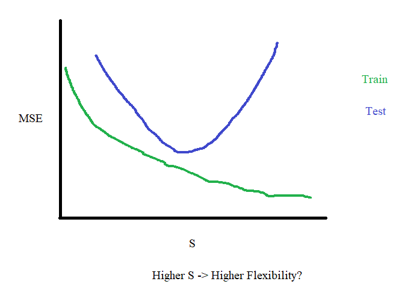

```{r setup, include=FALSE}
knitr::opts_chunk$set(echo = TRUE)
knitr::opts_chunk$set(results="hide")
knitr::opts_chunk$set(message=FALSE)
options(warn=-1)

library(tidyverse)
library(leaps)
library(e1071)
library(klaR)
library(caret)
library(class)

```

<style type="text/css">
@import url("https://cdn.jsdelivr.net/npm/bulma@0.9.3/css/bulma.min.css");
</style>

```{=html}
<section class="section">
<div class="card">
  <header class="card-header">
    <p class="card-header-title">
      
      1. Concept Review
      
    </p>
  </header>
  
  <div class="card-content">
    <div class="content">
     
     a. Compenent (a) is our least squares estimate. (b) is the ellipse of possible values of the estimate once a penalty term is applied. (c) and (d) are the constraints that Lasso and Ridge regressions place on the lease squares estimate + penalty. Because Lasso's constraint involves an absolute value, and therefore a diamond shape, it becomes possible for the ellipse of beta values to lie on an axis, setting a coefficient to zero. The circle constraint of ridge makes it impossible, but it can get very close.
     
    </div>
  </div>
  
  <div class="card-content">
    <div class="content">
     
     b. False. QDA can have different covariance matrices, whereas Bayes cannot.
     
    </div>
  </div>
  
  <div class="card-content">
    <div class="content">
     
     Wrong: c. False. Those selection criteria apply penalties for the number of predictors in a model, so it doesn't make sense to use them to compare models of the same size. When the models are the same size, we can look at r^2 or test MSE, depending on our application.
     
     Correct: c. True. Those selection criteria apply penalties for the number of predictors in a model, so it doesn't make sense to use them to compare models of the same size. When the models are the same size, we can look at RSS or test MSE, depending on our application.
     
    </div>
  </div>
  
  <div class="card-content">
    <div class="content">
     
     d. I disagree. Cross validation should be done on the training set, not all data. Test set should not be touched until we have a model ready to compute test MSE with.
     
    </div>
  </div>
  
</section>
  
<hr/>
```

```{r}
heart = read.table("http://www-stat.stanford.edu/~tibs/ElemStatLearn/datasets/SAheart.data",sep=",",head=T,row.names=1)
n = nrow(heart)
```
```{r, class.source='fold-show', results="show"}
logit.fit = glm(chd~age, data=heart, family='binomial')
x = data.frame(age=50)
logit50Prob = predict(logit.fit, x, type='response')
logit50Prob
```
```{r results="show"}
B = 2000
logit50Probs = rep(0,B)
for(b in 1:B){
  bootindex = sample(1:n,n,replace=TRUE)
  bootsample = heart[bootindex,]
  
  fit = glm(chd~age, data=bootsample, family='binomial')
  logit50Probs[b] = predict(fit, x, type='response')
}

bootmean = mean(logit50Probs)
sqrt(sum((logit50Probs-bootmean)^2)/(B-1))
```
```{=html}
<section class="section">
<div class="card">
  <header class="card-header">
    <p class="card-header-title">
      
      2a. Bootstrap & Logit
      
    </p>
  </header>
  
  <div class="card-content">
    <div class="content">
     
     a. See code
     
    </div>
  </div>
  
  <div class="card-content">
    <div class="content">
     
     b. 0.4215756
     
    </div>
  </div>
  
  <div class="card-content">
    <div class="content">
     
     c. ~0.02693479
     
    </div>
  </div>
  
</section>

<hr/>
```

```{r}
test = heart[1:100,-5]
train = heart[-(1:100),-5]
```
```{r results="show"}
K = c(1, 3, 5, 7, 9)
standardizedX = scale(train[,-9])

misclassifications = matrix(NA, 5, nrow(train))

for(i in 1:5){
  k = K[i]
  for(j in 1:nrow(train)) {
    loo = j
    
    testX = standardizedX[loo,]
    trainX = standardizedX[-loo,]
    
    testY = train$chd[loo]
    trainY = train$chd[-loo]
    
    knn.pred = knn(trainX, testX, trainY, k=k)
    misclassifications[i,j] = testY != knn.pred
  }
}
cvMisclassification = apply(misclassifications,1,mean)
paste0("Best k is ",K[which.min(cvMisclassification)])
```
```{r results="show"}
train.X = standardizedX
train.Y = train$chd
test.X = scale(test[,-9])
knn.pred = knn(train.X, test.X, train.Y, k=9)

tab = table(knn.pred, test$chd)
tab
mean(test$chd != knn.pred)
```
```{r results="show"}
mean(test$chd != 0)
```

```{=html}
<section class="section">
<div class="card">
  <header class="card-header">
    <p class="card-header-title">
      
      2b. KNN
      
    </p>
  </header>
  
  <div class="card-content">
    <div class="content">
     
     a. Best k is 9
     
    </div>
  </div>
  
  <div class="card-content">
    <div class="content">
     
     b. See output above for confusion matrix and misclassification rate
     
    </div>
  </div>
  
  <div class="card-content">
    <div class="content">
     
     c. We get 0.39. It's slightly higher than what we got in (b), but suprisingly not higher than I thought it would be.
     
    </div>
  </div>
  
  <div class="card-content">
    <div class="content">
     
     Extra Credit: <br>
     
      <figure class="image">
        
      </figure>
    </div>
  </div>
  
</section>
  
<hr/>
```

