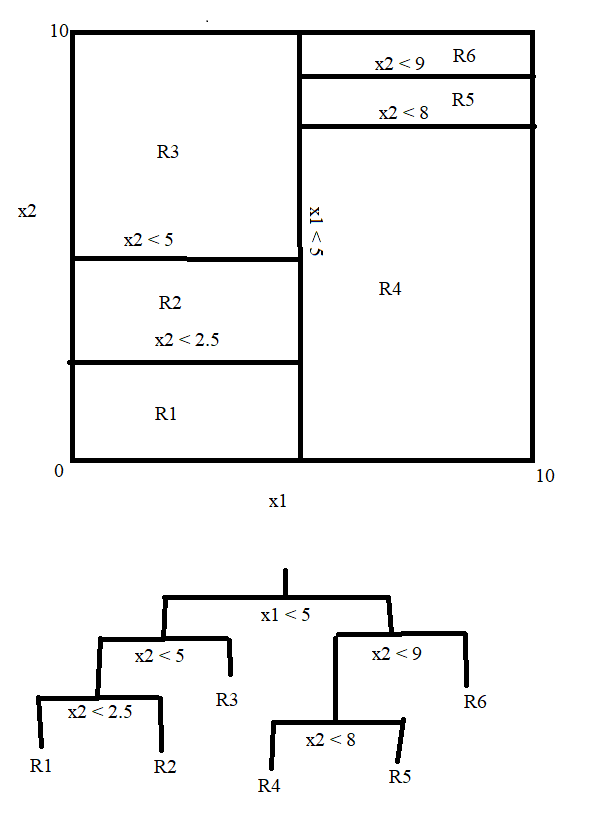
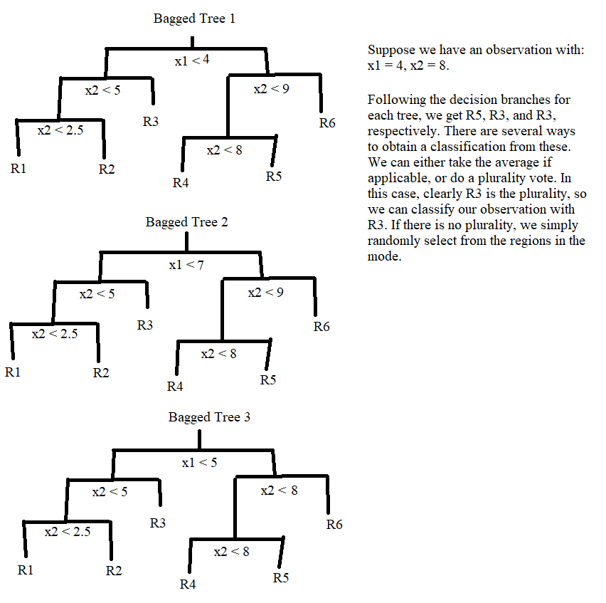

<style type="text/css">
@import url("https://cdn.jsdelivr.net/npm/bulma@0.9.3/css/bulma.min.css");
</style>

```{r setup, include=FALSE}
knitr::opts_chunk$set(results="hide")
knitr::opts_chunk$set(echo = TRUE)

library(tidyverse)
library(ggplot2)
library(caret)
library(tree)
library(glmnet)
library(ROCR)
library(MASS)
library(ISLR2)

set.seed(111)
```

```{r results="show"}
spam = read.csv('spambase.data', header = FALSE)
spam$V58 = as_factor(spam$V58)
```
```{r}
sum(spam$V58==1)/nrow(spam)
sum(spam$V58==0)/nrow(spam)
```

```{r results="show"}
# 4b
trainIndex = createDataPartition(spam$V58, p = .60, list = FALSE)
train = spam[trainIndex,]
test = spam[-trainIndex,]
print("Train spam proportion")
sum(train$V58==1)/nrow(train)
print("Test spam proportion")
sum(test$V58==1)/nrow(test)
```

```{r results="show"}
glm.fit = glm(V58~., data = train, family='binomial')

glm.prob = predict(glm.fit, test, type='response')


glm.pred = rep(0, nrow(test))
glm.pred[glm.prob > 0.5] = 1

tab = table(glm.pred, test$V58)

tab
1 - sum(diag(tab)) / sum(tab) # Misclassification rate
tab[2, 1] /sum(tab) # False positive
tab[1, 2]/sum(tab) # False negative
```
```{r results="show"}
# new threshold
glm.pred = rep(0, nrow(test))
glm.pred[glm.prob > 0.55] = 1

tab = table(glm.pred, test$V58)

tab
1 - sum(diag(tab)) / sum(tab) # Misclassification rate
tab[2, 1] /sum(tab) # False positive
tab[1, 2]/sum(tab) # False negative
```

```{r}
ROCRpred = prediction(glm.prob, test$V58)
perf = performance(ROCRpred,'tpr','fpr')
```
```{r}
plot(perf,
  colorize = TRUE,
  print.cutoffs.at = seq(0, 1, by = 0.1),
  text.adj = c(-0.2, 1.7),
  main = "Logistic")
```

```{r results="show"}
lda.fit = lda(V58~., data = train)

lda.prob = predict(lda.fit, test, type = "response")$posterior[, 2]
lda.pred = rep(0, nrow(test))
lda.pred[lda.prob > 0.5] <- 1

tab = table(lda.pred, test$V58)

tab
1 - sum(diag(tab)) / sum(tab) # Misclassification rate
tab[2, 1] / sum(tab) # False positive
tab[1, 2] / sum(tab) # False negative
```
```{r}
ROCRpred <- prediction(lda.prob, test$V58)
plot(performance(ROCRpred, "tpr", "fpr"),
  colorize = TRUE,
  print.cutoffs.at = seq(0, 1, by = 0.1),
  text.adj = c(-0.2, 1.7),
  main = "LDA")
```

```{=html}
<section class="section">
<div class="card">
  <header class="card-header">
    <p class="card-header-title">
      
      1. ROC with Spam
      
    </p>
  </header>
  
  <div class="card-content">
    <div class="content">
     
        a. Reporting a meaningful email as spam, a false positive, is a more critical mistake. It's okay if some spam gets through, but a job offer in spam would be awful.

    </div>
  </div>

  <div class="card-content">
    <div class="content">
     
        b. See ROC Curve above.

    </div>
  </div>
  
  <div class="card-content">
    <div class="content">
     
        c. False positive: 0.03043478; False negative: 0.03695652

    </div>
  </div>

  <div class="card-content">
    <div class="content">
     
        d. Threshold adjusted to 0.55, giving a new false positive rate of 0.02337
    </div>
  </div>

  <div class="card-content">
    <div class="content">
     
        e. False positive: 0.02826087; False negative: 0.075 <br>
        Threshold does not need to be adjusted as fpr is already under 0.03 <br>
        If fpr needed to be reduced, I would increase the threshold, I.E. prob > 0.55

    </div>
  </div>
  
</div>
</section>

<hr/>
```

```{r class.source='fold-show'}
# 2a
trainIndex = sample(1:nrow(OJ), 800, replace = FALSE)
train = OJ[trainIndex,]
test = OJ[-trainIndex,]
```
```{r results="show"}
# 2b-d
tree.OJ = tree(Purchase~., data=train)
summary(tree.OJ)

tree.OJ

plot(tree.OJ)
text(tree.OJ,pretty=0)
```
```{=html}
<section class="section">
<div class="card">
  <header class="card-header">
    <p class="card-header-title">
      
      2. Decision Tree with OJ
      
    </p>
  </header>
  
  <div class="card-content">
    <div class="content">
     
        a. See code above.

    </div>
  </div>

  <div class="card-content">
    <div class="content">
     
        b. We get 8 terminal nodes and a training misclassiciation error of 0.1662.

    </div>
  </div>

  <div class="card-content">
    <div class="content">
     
        c. Interpreting node 8: <br>
        An observation with LoyalCH < 0.03564 will be marked as a Minute Made purchase.

    </div>
  </div>

  <div class="card-content">
    <div class="content">
     
        d. The tree has 7 decision branches and 8 regions.

    </div>
  </div>

</div>
</section>

<hr/>
```

```{r results="show"}
tree.prob = predict(tree.OJ, newdata=test)[, 2]

tree.pred = rep(1, nrow(test))
tree.pred[tree.prob > 0.5] = 2

tab = table(tree.pred, test$Purchase)
tab
1 - sum(diag(tab)) / sum(tab)
```
```{r}
cv.OJ = cv.tree(tree.OJ) #performs CV in on order to the determine the optimal level of tree complexity. 
plot(cv.OJ$size, cv.OJ$dev, type='b') # plot CV error as a function of size of tree 
```
```{r, class.source='fold-show', results="show"}
prune.OJ= prune.tree(tree.OJ, best=6) #best represents the size of a specific subtree in the cost-complexity sequence to be returned
summary(prune.OJ)
```
```{r results="show"}
prune.prob = predict(prune.OJ, newdata=test)[, 2]

prune.pred = rep(1, nrow(test))
prune.pred[prune.prob > 0.5] = 2

tab = table(prune.pred, test$Purchase)
tab
1 - sum(diag(tab)) / sum(tab)
```
```{=html}
<section class="section">
<div class="card">
  <header class="card-header">
    <p class="card-header-title">
      
      2. Decision Tree with OJ (Continued)
      
    </p>
  </header>
  
  <div class="card-content">
    <div class="content">
     
        e. See output above for confusion matrix. Misclassification rate of 0.162963

    </div>
  </div>

  <div class="card-content">
    <div class="content">
     
        f+g. See plot above. The optimal tree size is 6.

    </div>
  </div>

  <div class="card-content">
    <div class="content">
     
        h. See code above.

    </div>
  </div>

  <div class="card-content">
    <div class="content">
     
        i. Unpruned MSE: 0.1662; Pruned MSE: 0.1775 <br>
        The higher training error in the pruned tree is expected because pruning reduces the flexibility of the tree, which worsens the fit to the training data.
    </div>
  </div>

  <div class="card-content">
    <div class="content">
     
        j. Unpruned test MSE: 0.162963; Pruned test MSE: 0.1814815 <br>
        I thought that the pruned tree would have a better test MSE, but apparently not. This could either be due to random chance, or it was over-pruned.
        
    </div>
  </div>

</div>
</section>

<hr/>
```

```{=html}
<section class="section">
<div class="card">
  <header class="card-header">
    <p class="card-header-title">
      
      3. Concept Review
      
    </p>
  </header>
  
  <div class="card-content">
    <div class="content">
     
        a. <br>
        <figure class="image">
          
        </figure>

    </div>
  </div>
  
  <div class="card-content">
    <div class="content">
     
        b. <br>
        <figure class="image">
          
        </figure>

    </div>
  </div>

  <div class="card-content">
    <div class="content">
     
        c. 0.1, 0.15, 0.2, 0.2, 0.55, 0.6, 0.6, 0.65, 0.7, 0.75. <br>
        Majority Vote: G, G, G, G, R, R, R, R, R, R = Red <br>
        Average Prob. = 0.45 = Green <br>
        They're different!

    </div>
  </div>
  
</div>
</section>

<hr/>
```